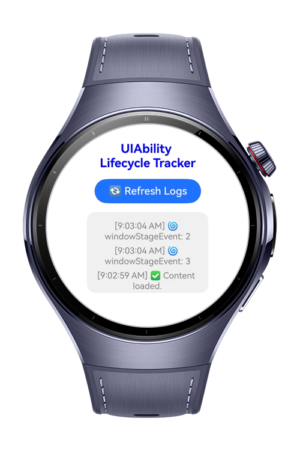
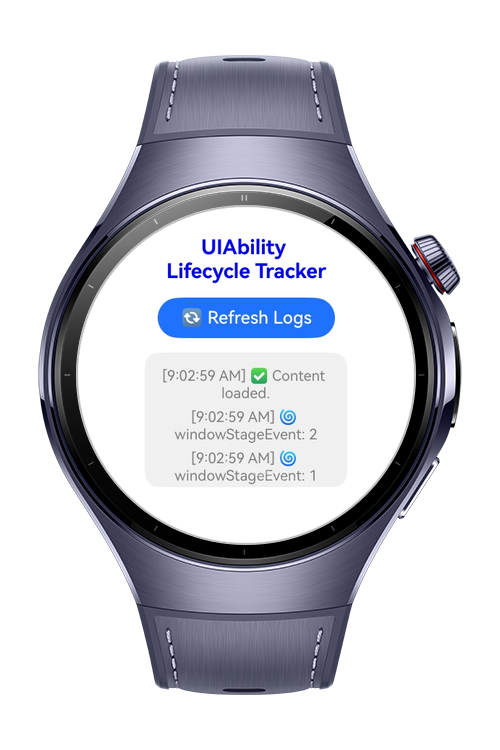
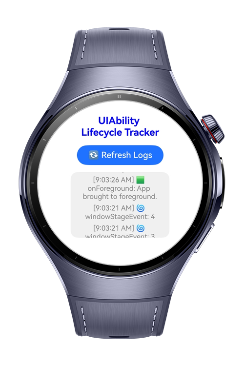

> **Note:** To access all shared projects, get information about environment setup, and view other guides, please visit [Explore-In-HMOS-Wearable Index](https://github.com/Explore-In-HMOS-Wearable/hmos-index).

# How To Use UIAbility Lifecycle on HarmonyOS?

This codelab visually tracks the lifecycle events (`onCreate`, `onDestroy`, etc.) of a **UIAbility** component, allowing developers to observe how the system manages app states in real-time and provides a simple user interface to view lifecycle logs and refresh them on demand. It is especially useful for debugging behavior during app state transitions or for educational purposes.

# Preview

<div>
  
  
  
</div>

# Use Cases

- **UIAbility Lifecycle Monitoring**: Logs key events in the lifecycle of the app’s main component.
- **Manual Log Refresh**: A simple button allows refreshing the log view on demand.
- **Minimal UI**: Clean and responsive layout tailored for small screens (e.g., smartwatches).

# Technology
## Stack
- **Languages**: ArkTS, ArkUI
- **Frameworks**: HarmonyOS SDK 5.0.2(14)
- **Tools**: DevEco Studio Version 5.1.0.828
- **Libraries**:
  - `@kit.ArkUI`
  - `@kit.PerformanceAnalysisKit`
  - `@kit.AbilityKit`

## Required Permissions
- No need for any specific permission.

# Directory Structure

``` 
LifecycleTracker
|--- entry/src/main/ets/
| |--- common/
| | |--- util/
| | | |--- LifecycleLog.ets
| |
| |--- pages/
| | |--- Index.ets
| |
| |--- resources/
| |--- screenshots/
```

# Constraints and Restrictions
## Supported Device

* Huawei Watch 5

# License

**UIAbilityLifecycleTracker** is distributed under the terms of the MIT License
See the [LICENSE](./LICENSE) for more information.
